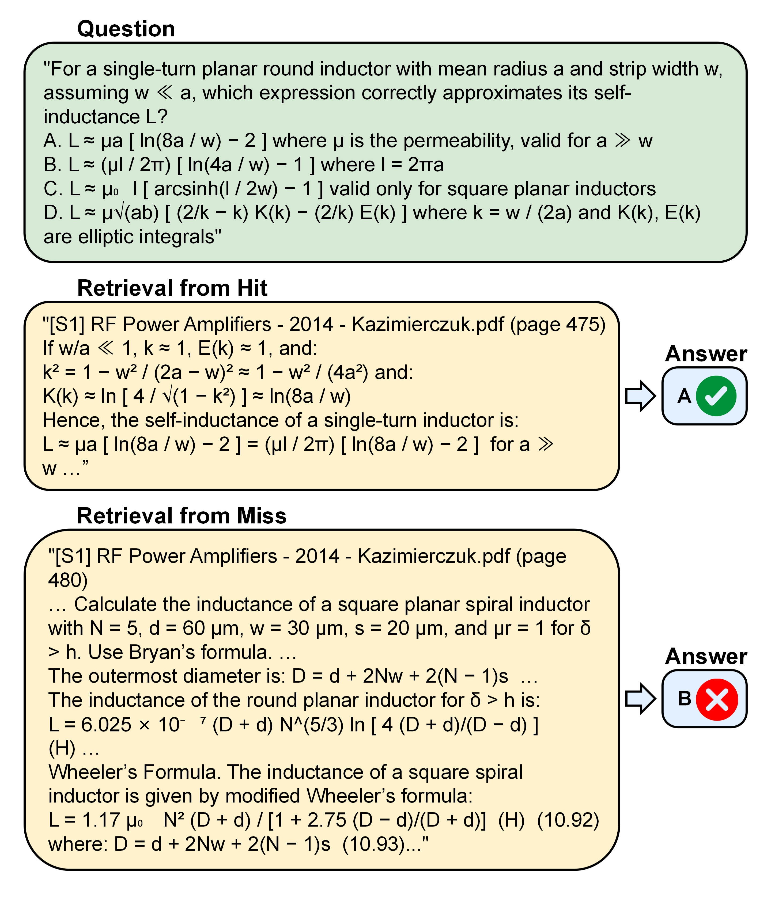

# RF-Agent — Worked Examples

This folder collects two representative examples that illustrate the core
mechanics of RF-Agent: a single **mcQTSA reasoning sample** (the
Question–Thinking–Solution–Answer format used for both training and evaluation)
and a **RAG hit-vs-miss retrieval case** (showing how retrieval quality drives
answer correctness). Each is shown as the figure from the paper and linked to
the released data it was drawn from.

---

## 1. Representative mcQTSA Sample — SSB Mixer Spur Analysis

The figure shows one complete Question–Thinking–Solution–Answer sample. The same
format is used as supervised training data and, in its multiple-choice form, as
the evaluation benchmark.

- **Source dataset:** `QAs from textbooks/dataset&benchmark/mcQTSA_new4/`
- **Benchmark partition:** `SFT/Qwen3-0.6B/testbench/mcQTSA_test_final.jsonl`
- **Reasoning perspective:** circuit-level behavior / performance analysis

**Question.** In a direct-conversion transmitter using an SSB mixer with input
frequencies ω1 and ω2 = ω1/2, the desired output is at ω1 + ω2 = 3ω1/2, with
third-order spurs at 3ω1 − ω2 and 3ω2 − ω1. If the port sensing ω2 is linearized
to suppress its associated spur, which spur remains problematic?

- **A.** ω1/2 spur — too close to the carrier for LC filtering
- **B.** 5ω1/2 spur — arises from the ω1-port nonlinearity, outside the easily filterable band
- **C.** 5ω1/2 spur — indistinguishable from the carrier at 3ω1/2
- **D.** 3ω1/2 spur — coincides with the desired signal

**Key reasoning** (full trace in the figure). Substituting ω2 = ω1/2 gives the
two spurs 3ω1 − ω2 = 5ω1/2 and 3ω2 − ω1 = ω1/2. Linearizing the ω2-sensing port
suppresses the ω1/2 spur, but the 5ω1/2 spur originates from the ω1-port
nonlinearity and cannot be simultaneously linearized, so it remains and requires
substantial filtering.

**Answer: B**

---

## 2. Representative RAG Hit-vs-Miss Case — Single-Turn Inductor Self-Inductance

This example illustrates the hit/miss validation used to confirm that accuracy
gains stem from retrieval quality rather than incidental context injection. For
the same question, the **hit** condition uses the top-3 retrieved chunks as
context, while the **miss** condition uses the next three chunks (ranks 4–6) from
the same retrieval run.

**Question.** For a single-turn planar round inductor with mean radius *a* and
strip width *w* (*w ≪ a*), which expression correctly approximates its
self-inductance *L*?

- **A.** L ≈ μa [ ln(8a/w) − 2 ], valid for a ≫ w
- **B.** L ≈ (μl/2π) [ ln(4a/w) − 1 ], l = 2πa
- **C.** L ≈ μ₀l [ arcsinh(l/2w) − 1 ], square planar inductors only
- **D.** L ≈ μ√(ab) [ (2/k − k) K(k) − (2/k) E(k) ], k = w/2a, elliptic integrals

| Condition | Retrieved context (source) | Model answer | Correct? |
|-----------|----------------------------|--------------|----------|
| **Hit**  | top-3 chunks — *RF Power Amplifiers* (Kazimierczuk), p. 475 (exact single-turn derivation) | **A** | ✅ |
| **Miss** | ranks 4–6 — *RF Power Amplifiers* (Kazimierczuk), p. 480 (square-spiral / Wheeler's formula) | **B** | ❌ |

The hit chunk surfaces the precise derivation needed; the miss chunk retrieves a
related but insufficient passage from the same document, leading to an incorrect
choice.

**Full retrieved chunks (released data)** — hit/miss contexts and model answers
for every benchmark question (example below: Qwen3-4B-Thinking, basic config):

- Hit contexts: `RAG/hit_miss_qwen3/results/100_Qwen3_4B_thinking_contexts_Basic_hit.jsonl`
- Miss contexts: `RAG/hit_miss_qwen3/results/100_Qwen3_4B_thinking_contexts_Basic_miss.jsonl`
- Model answers: `RAG/hit_miss_qwen3/results/100_Qwen3_4B_thinking_RAG_Basic_hit.jsonl` and `…_miss.jsonl`

Equivalent files for the 0.6B and 1.7B models and the keyword/hybrid
configurations are in the same `RAG/hit_miss_qwen3/results/` directory.

---

*Question text and math notation are transcribed from the paper figures for
searchability and accessibility; the rendered figures above are authoritative.*
